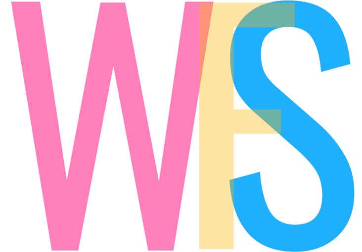

# WebFromScratch

Simple and easy to use website, which offers you the best information and newest features from the web development sphere. Start your journey now !

## For who is this website?

Mainly this website aims those who are new to web development. It contains a lot of information for those who just started. But in addition we have got plenty of information about newest features and useful information for those who have been already studying or practicing for a while.

## Learning Materials

For the time being our website contains:

- Basics
- HTML
- CSS
- JS
- SQL
- GIT

_This training project was developed by students of **remote_ru_dev_nov20** group of the [Wild Code School](https://www.wildcodeschool.com/en-GB)_

## Contributors

| Name                  | GitHub                          |
| --------------------- | ------------------------------- |
| Nazar Archakov        | https://github.com/hidemydreams |
| Tatsiana Horbatsevich | https://github.com/gortatka     |
| Natalia Lapitskaya    | https://github.com/LapitskayaN  |
